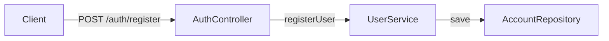
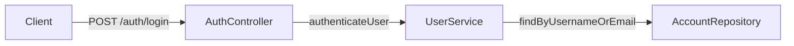
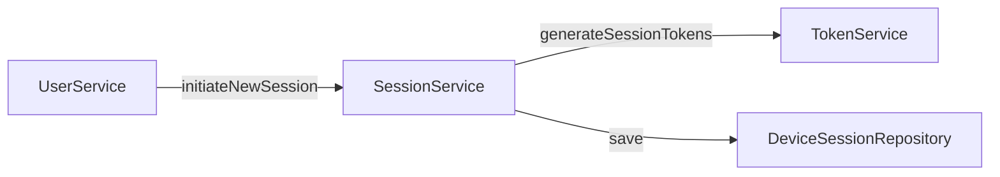
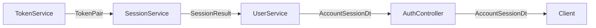
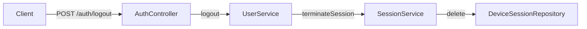

# Auth reference
Created: 09/07/2026 Last updated: 10/07/2026

## Overview
This document outlines the interactions of services and AuthController to fulfill the auth and session endpoint requirements of the main spec repo's `endpoints.md`.

## Owns:
- Order of operations following endpoints.
- Flow of calls (e.g. AuthController to UserService).
- How response DTOs get assembled from their component parts.

## Does not own:
- Endpoint definitions — see [`endpoints.md`](https://github.com/martinsterentjevs/cacheit-spec/blob/main/docs/technical/api/endpoints.md)
- DTO schema shapes — see [`schemas.md`](https://github.com/martinsterentjevs/cacheit-spec/blob/main/docs/technical/api/schemas.md)
- Account management endpoints (`/account/*`) or Note flows — **Not created yet** ~~see [`account-reference.md`](account-reference.md)  and [`note-reference.md`](note-reference.md) respectively~~. (Account *creation* during registration, and the device-deletion operation Logout shares with self-revocation, are this doc's job — see `decisions/0001-...md`. The standalone `/account/devices` management endpoints themselves live in `account-reference.md`.)~~

## Related documentation:
- **Not created yet** ~~[`account-reference.md`](account-reference.md) — shares the device-deletion operation with Logout~~
- `decisions/0001-logout-shares-device-session-deletion.md`

---

### Registration
Last updated: 10/07/2026

Client call — front end only; hands off into New session issuance below.



`UserService.registerUser()` persists the new `Account`, then continues into **New session issuance** (shared, below).

#### Expected failures
- `400` — neither `username` nor `email` provided.
- `400` — `username` or `email` already taken (unique constraint violation).

*Still open: both collapse to `400` per `endpoints.md` — confirm that's intentional, or whether "already taken" deserves its own status.*

---

### Login
Last updated: 10/07/2026

Client call — front end only; hands off into New session issuance below.



*`authenticateUser` proposed for symmetry with `registerUser` — not yet confirmed.* Verifies the password hash against `Account.passwordHash`, then continues into **New session issuance** (shared, below).

#### Expected failures
- `401` — no matching account, or password hash doesn't verify.

---

### New session issuance (shared — Registration and Login converge here)
Last updated: 10/07/2026

Client call:


Response (shapes):

`SessionResult` is an internal value for the TokenPair and DeviceSession as a bundled singular variable.
---

### Session rotation (Refresh)
Last updated: 13/07/2026

Client call:
​```mermaid
graph LR
    start[Client]
    a[AuthController]
    b[UserService]
    c[SessionService]
    d[TokenService]
    dsRepo[DeviceSessionRepository]
    start--POST /auth/refresh-->a--refreshSession-->b--validateAndRotateSession-->c--findByDeviceId-->dsRepo
    c--validateToken-->d--generateSessionTokens-->c
​```

`SessionService` never compares token values itself — it hands the presented token to `TokenService.validateToken()`, and only on success asks `TokenService.generateSessionTokens()` for the replacement pair, then persists the rotation (`update`).

Response (shapes): same as **New session issuance** — ends in `AccountSessionDto`.

#### Expected failures
- `401` — token invalid, expired, or already rotated (single-use). Optional machine-readable code — envelope shape TBD, cross-repo decision, not specced here.
- `ACCOUNT_TERMINATED` — best-effort only, per `decisions/`.
---

### Session termination (Logout)
Last updated: 10/07/2026



Per `decisions/0001-...md`: `deviceId` is resolved from the current JWT's claim, not a path param — the only difference from `DELETE /account/devices/{deviceId}`'s own flow (see `account-reference.md`), which resolves it explicitly instead. Same underlying `SessionService`/repository operation, two callers.

#### Expected failures
- `401` — no valid session to terminate.


---

### Schema Assembly and definitions
Last updated: 10/07/2026

Diagrams above show shapes flowing; this section shows how each shape gets built. `TokenPair` is internal to `TokenService`, not a wire DTO.

**TokenPair**
| Field | Source |
|---|---|
| accessToken | New signed JWT (RS256), embedding `userId` + `deviceId` claims |
| refreshToken | New opaque random token; hashed before persistence |

**AccountSessionDto** (see `schemas.md`)
| Field | Source |
|---|---|
| userId | `Account.userId` |
| deviceId | `DeviceSession.deviceId` |
| accessToken | `TokenPair.accessToken` |
| refreshToken | `TokenPair.refreshToken` — plaintext returned once; hashed copy is what's persisted |
| encMekEnvelope | `Account.mekEnvelope` |