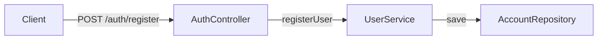
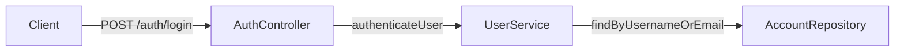
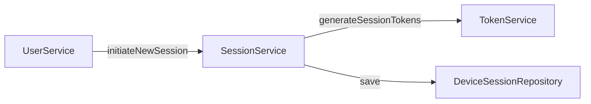
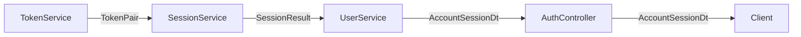
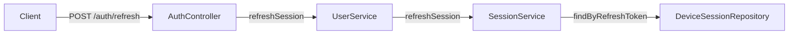
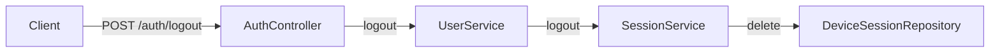

# Auth reference
Created: 09/07/2026 Last updated: 02/08/2026

## Overview
This document outlines the interactions of services and AuthController to fulfill the auth and
session endpoint requirements of the main spec repo's `endpoints.md`. Issue 3 (auth layer) is
closed as of this update — all flows below are verified against a passing integration test suite,
not just designed on paper.

## Owns:
- Order of operations following endpoints.
- Flow of calls (e.g. AuthController to UserService).
- How response DTOs get assembled from their component parts.

## Does not own:
- Endpoint definitions — see [`endpoints.md`](https://github.com/martinsterentjevs/cacheit-spec/blob/main/docs/technical/api/endpoints.md)
- DTO schema shapes — see [`schemas.md`](https://github.com/martinsterentjevs/cacheit-spec/blob/main/docs/technical/api/schemas.md)
- Exception-to-status/error-code mapping — see `exceptions.md`
- Account management endpoints (`/account/*`) or Note flows — **Not created yet**. Account
  *creation* during registration, and the device-deletion operation Logout shares with
  self-revocation, are this doc's job — see `decisions/0001-logout-shares-device-session-deletion.md`.
  The standalone `/account/devices` management endpoints themselves will live in a future
  `account-reference.md`.

## Related documentation:
- `exceptions.md` — every "Expected failures" section below should match a row there
- `decisions/0001-logout-shares-device-session-deletion.md`

---

### Registration
Last updated: 02/08/2026

Client call — front end only; hands off into New session issuance below.

```mermaid
graph LR
    start[Client]
    a[AuthController]
    b[UserService]
    acctRepo[AccountRepository]
    start--POST /auth/register-->a--registerUser-->b--save-->acctRepo
```

`UserService.registerUser()` persists the new `Account` via `AccountRepository.save()`, then
continues into **New session issuance** (shared, below).

#### Expected failures
- `400 INVALID_REGISTRATION_REQUEST` — neither `username` nor `email` provided. Via
  `InvalidRegistrationException`.
- `400 ACCOUNT_ALREADY_EXISTS` — `username` or `email` already taken. Via
  `AccountAlreadyExistsException`.
- `400 VALIDATION_ERROR` — a Bean Validation constraint fails (blank required field, malformed
  `encMekEnvelope` shape). Via `MethodArgumentNotValidException`.
- `400 MALFORMED_REQUEST_BODY` — request body isn't valid JSON, or a field can't deserialize
  (e.g. non-UUID `deviceId`). Via `HttpMessageNotReadableException`.

---

### Login
Last updated: 02/08/2026

Client call — front end only; hands off into New session issuance below.

```mermaid
graph LR
    start[Client]
    a[AuthController]
    b[UserService]
    acctRepo[AccountRepository]
    start--POST /auth/login-->a--authenticateUser-->b--findByUsernameOrEmail-->acctRepo
```

Verifies the password hash against `Account.passwordHash`, then continues into **New session
issuance** (shared, below).

#### Expected failures
- `401 INVALID_CREDENTIALS` — no matching account, or password hash doesn't verify. Deliberately
  the same failure for both — the response never discloses which one was true.
- `400 VALIDATION_ERROR` — `identifier` or `password` blank. Via `MethodArgumentNotValidException`.

---

### New session issuance (shared — Registration and Login converge here)
Last updated: 10/07/2026

Client call:

```mermaid
graph LR
    b[UserService]
    c[SessionService]
    d[TokenService]
    dsRepo[DeviceSessionRepository]
    b--initiateNewSession-->c--generateSessionTokens-->d
    c--save-->dsRepo
```

Response (shapes):

```mermaid
graph LR
    d[TokenService]
    c[SessionService]
    b[UserService]
    a[AuthController]
    start[Client]
    d--TokenPair-->c--SessionResult-->b--AccountSessionDto-->a--AccountSessionDto-->start
```
`SessionResult` is an internal value bundling the `TokenPair` and the persisted `DeviceSession`
into a single return value.

---

### Session rotation (Refresh)
Last updated: 02/08/2026

Client call:

```mermaid
graph LR
    start[Client]
    a[AuthController]
    b[UserService]
    c[SessionService]
    dsRepo[DeviceSessionRepository]
    start--POST /auth/refresh-->a--refreshSession-->b--refreshSession-->c--findByRefreshToken-->dsRepo
```

`SessionService.refreshSession()` looks the presented refresh token up directly against
`DeviceSessionRepository.findByRefreshToken()` — there is no separate `TokenService` validation
step for refresh tokens, since they are opaque random strings, not JWTs; the repository lookup
itself *is* the validation. It also checks that the session's `deviceId` matches the `deviceId` in
the request body, rejecting a token replayed with a mismatched device.

On success it calls `SessionService.initiateNewSession()` with the same `deviceId`, which mints a
new `TokenPair` via `TokenService` and persists it — see **Replay protection** below for why no
explicit delete of the old session is needed.

Response (shapes): same as **New session issuance** — ends in `AccountSessionDto`.

#### Replay protection
`DeviceSession` is keyed by `deviceId` (one active session row per device). Because rotation reuses
the same `deviceId`, persisting the new session updates that row in place rather than inserting a
second one — the previous refresh token value is overwritten and no longer matches anything on a
subsequent `findByRefreshToken` lookup. No separate token blocklist or explicit delete step exists
or is needed; the single-row-per-device schema *is* the replay guard.

#### Expected failures
- `400 INVALID_SESSION` — refresh token doesn't match any session, or the request's `deviceId`
  doesn't match the session's `deviceId` (including a replayed, already-rotated token — its old
  value no longer matches any row). Via `InvalidSessionException`.
- `400 MALFORMED_REQUEST_BODY` — non-UUID `deviceId` or invalid JSON. Via
  `HttpMessageNotReadableException`.
- `ACCOUNT_TERMINATED` — best-effort only, per `decisions/` (cross-repo protocol decision — see
  `cacheit-spec`, not specced further here).

---

### Session termination (Logout)
Last updated: 02/08/2026

```mermaid
graph LR
    start[Client]
    a[AuthController]
    b[UserService]
    c[SessionService]
    dsRepo[DeviceSessionRepository]
    start--POST /auth/logout-->a--logout-->b--logout-->c--delete-->dsRepo
```

Per `decisions/0001-...md`: `deviceId` is resolved from the current JWT's claim, not a path param —
the only difference from `DELETE /account/devices/{deviceId}`'s own flow (future
`account-reference.md`), which resolves it explicitly instead. Same underlying `SessionService`
operation, two callers.

`SessionService.logout()` extracts the `userId` and `deviceId` from the presented access token
(throwing on a structurally invalid token before either extraction completes), looks the device up,
and confirms the session's account matches the token's `userId` before deleting the row.

#### Expected failures
- `401 UNAUTHORIZED` — `Authorization` header missing entirely. Via `MissingRequestHeaderException`.
- `401 INVALID_TOKEN` — header present but the JWT itself is malformed, unsigned, or expired. Via
  `InvalidTokenException`.
- `400 INVALID_SESSION` — token is structurally valid but doesn't resolve to an active session
  (device not found, or session belongs to a different account than the token claims). Via
  `InvalidSessionException`.

---

### Schema Assembly and definitions
Last updated: 02/08/2026

The diagrams above show shapes flowing; this section shows how each shape gets built. `TokenPair`
is internal to `TokenService`, not a wire DTO.

**TokenPair**

| Field | Source |
|---|---|
| accessToken | New signed JWT (HS256, single shared `JWT_SECRET`), embedding `sub` (userId) + `deviceId` claims |
| refreshToken | New opaque random token (32 bytes, base64url-encoded) |

> **Open item:** the refresh token is currently persisted and compared as plaintext
> (`DeviceSessionRepository.findByRefreshToken` does a direct equality match). A prior draft of
> this doc assumed a hashed-at-rest design; that was never implemented. Revisit before wider
> release — a DB compromise currently exposes usable refresh tokens directly. Track as a follow-up
> ADR if the fix requires a schema/lookup-strategy change (hashing breaks direct-lookup-by-value).

**AccountSessionDto** (see `schemas.md`)

| Field | Source |
|---|---|
| userId | `Account.userId` |
| deviceId | `DeviceSession.deviceId` |
| accessToken | `TokenPair.accessToken` |
| refreshToken | `TokenPair.refreshToken` — returned to the client in plaintext; also what's currently persisted as-is (see Open item above) |
| encMekEnvelope | `Account.mekEnvelope` |