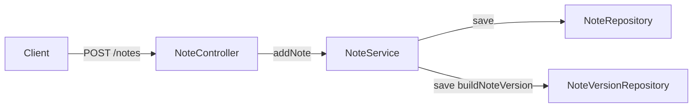
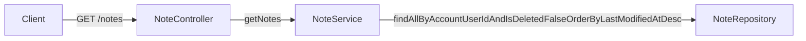
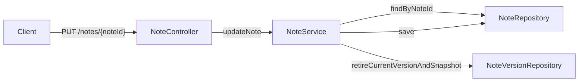
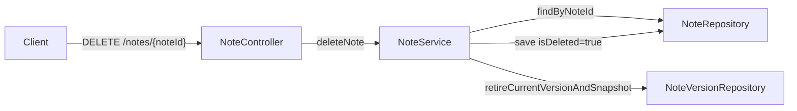
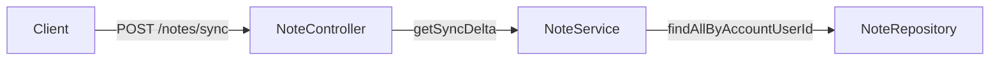
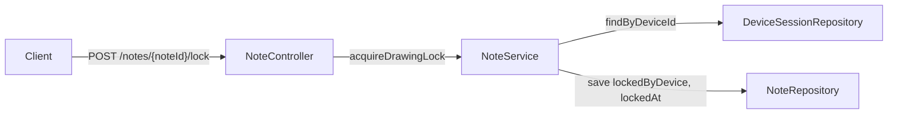
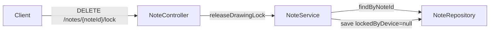
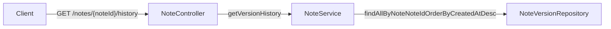
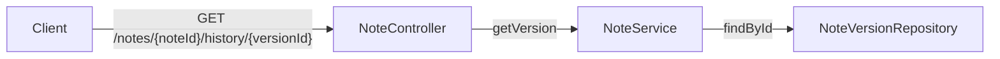
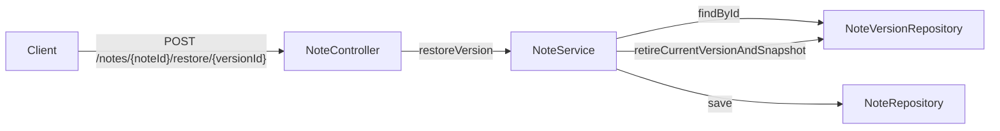

# Note reference
Created: 02/08/2026 Last updated: 19/08/2026

## Overview
This document outlines the interactions of services and `NoteController` to fulfill the note CRUD,
versioning, sync, and drawing-lock endpoint requirements of the main spec repo's `endpoints.md`.
This is the blueprint the implementation follows - same role `auth-reference.md` played for the
auth layer. Where this doc extends or deviates from the current cross-repo spec, that's called out
explicitly as a follow-up spec-repo item, not left ambiguous.

## Owns:
- Order of operations following endpoints.
- Flow of calls (e.g. `NoteController` to `NoteService`).
- How response DTOs get assembled from their component parts.
- Drawing lock acquisition, release, and expiry semantics.

## Does not own:
- Endpoint definitions - see [`endpoints.md`](https://github.com/martinsterentjevs/cacheit-spec/blob/main/docs/technical/api/endpoints.md)
- DTO schema shapes - see [`schemas.md`](https://github.com/martinsterentjevs/cacheit-spec/blob/main/docs/technical/api/schemas.md) - **see Spec follow-ups, below, for two places this doc currently extends past it**
- WebSocket nudge signal definitions - see [`events.md`](https://github.com/martinsterentjevs/cacheit-spec/blob/main/docs/technical/api/events.md). WS implementation itself is deferred; this doc references nudge types by name only, they are not yet fired.
- Exception-to-status/error-code mapping - see `exceptions.md`

## Related documentation:
- `exceptions.md` - every "Expected failures" section below should match a row there
- `decisions/0002-note-version-includes-drawing-data.md`
- `auth-reference.md` - `getRequestIdentity`, `TokenService`, and `DeviceSession` patterns are reused here rather than redefined

## Spec follow-ups (server-repo is ahead of cross-repo spec on these two points)
- **`NoteVersionDto` includes `encDrawing`.** `schemas.md` currently only lists `versionId`,
  `encTitle`, `encBody`. Per `decisions/0002-...md`, version history captures drawing state - a
  restore that can't return drawing data isn't actually honoring that decision. Needs a
  `schemas.md` update to match.
- **`SyncManifestEntry` gets a full schema section.** `schemas.md` only describes it inline
  (`"Array of {noteId, lastModifiedAt}"` inside `SyncRequestDto.localNotes`'s Notes column) - no
  dedicated table like `NoteVersionMeta` gets. Shape used here: `{noteId: UUID, lastModifiedAt:
  Instant}`. Needs its own `schemas.md` section to match the other DTOs' documentation format.
- **Sync is `POST /notes/sync` with a request body, not `GET /notes/sync` with query params** as
  `sync-protocol.md` describes. `localNotes` is a list of objects, not scalars - Spring MVC has no
  clean way to bind that through query parameters without custom converter work, and a `GET` body
  is non-standard and gets stripped by some clients/proxies. Needs `sync-protocol.md` and
  `endpoints.md` updated to match, or an explicit decision to preserve `GET` via a flattened
  indexed query-param scheme instead.

---

### Note creation (Add)
Last updated: 19/08/2026



`NoteService.addNote()` resolves the caller's identity and device via
`UserService.getRequestIdentity()`, persists the new `Note`, then immediately snapshots it as the
first `NoteVersion` (`isCurrent = true`) via the shared `buildNoteVersion()` helper. ~~Server assigns
`noteId` and `userId` - the client never supplies either.~~ **NEW [19/08/2026]:** Server supplies `userId`, client supplies `noteId`  Returns the created `NoteDto`, `201`.

#### Expected failures
- `401` - invalid or missing access token.
- `400 VALIDATION_ERROR` - Missing `noteId` or `encTitle`. 

---

### Note listing (Get all)
Last updated: 02/08/2026



Returns all non-deleted notes for the caller, newest-edited first.

#### Expected failures
- `401` - invalid or missing access token.

---

### Note update (Edit / save)
Last updated: 04/08/2026



`NoteService.updateNote()` checks ownership, applies the incoming `title`/`body`/`drawing` fields,
refreshes `lastModifiedAt`, clears `lockedByDevice`/`lockedAt` as a defensive fallback (the primary
release mechanism is the explicit lock-release endpoint below), retires the previous current
`NoteVersion`, and snapshots the new state via the shared `retireCurrentVersionAndSnapshot()`
helper - the same helper `deleteNote` and `restoreVersion` use, since all three are "change the
note's state, then snapshot it" operations differing only in what changed.

#### Expected failures
- `401` - invalid or missing access token. 
- `403` -caller doesn't own the note.
- `404` - unknown `noteId`.
- `409` - a drawing edit-lock is held by a different, non-stale device. **Open item, unchanged:**
  `endpoints.md` doesn't scope this `409` to updates that touch `encDrawing` specifically - as
  built, the lock check only applies inside `acquireDrawingLock`, not `updateNote` itself, so a
  locked note's title/body can still be edited by another device today. Revisit if that's not the
  intended behavior.
- Last-write-wins by server `lastModifiedAt` - **open item, unchanged:** not yet implemented;
  `updateNote` overwrites unconditionally. The losing edit is still recoverable via version history
  regardless.

---

### Note deletion (Soft delete)
Last updated: 04/08/2026



`NoteService.deleteNote()` checks ownership, sets `isDeleted = true`, refreshes `lastModifiedAt`,
and snapshots via the same `retireCurrentVersionAndSnapshot()` helper `updateNote` uses - deletion
is a full-state change like any other, not a separate mechanism. `NoteVersion` has no `isDeleted`
field of its own; deletion state lives on `Note` only and is surfaced to other devices via
`SyncResponseDto.deletedIds`. Returns `204`, no body.

#### Expected failures
- `403` - caller doesn't own the note.
- `404` - unknown `noteId`.

---

### Delta sync
Last updated: 04/08/2026



**Deviates from `sync-protocol.md`** - see Spec follow-ups above (`POST` + body, not `GET` + query
params).

`NoteService.getSyncDelta()` loads *all* notes for the account - deleted and non-deleted, unlike
`getNotes()` - and diffs against `request.localNotes` (keyed by `noteId`): any server note that's
not deleted and is either missing from the client's manifest or newer than the manifest's recorded
`lastModifiedAt` goes into `updatedNotes`; any server note that *is* deleted and appears in the
client's manifest goes into `deletedIds`. Returns `SyncResponseDto` with `serverTime` set to
`Instant.now()` - the client stores this as its new `lastSyncedAt`.

#### Expected failures
- `401` - invalid or missing access token.

---

### Drawing lock - Acquire
Last updated: 04/08/2026



`NoteService.acquireDrawingLock()` checks ownership, resolves the caller's `DeviceSession`
(`InvalidSessionException` if none - an access token with no live session behind it), and allows
the acquisition if the note is unlocked, already locked by the same device, or locked by a
different device whose lock has gone stale. Otherwise, throws `NoteLockedException`, `409`.

**Lock TTL:** `NoteService.DRAWING_LOCK_TTL_SECONDS` (currently `3600`) - a fixed, independently
configured duration, deliberately *not* derived from or shared with the access token TTL, and *not*
extended by the holding device refreshing its session mid-edit. Anchored strictly to `lockedAt`:

```kotlin
Instant.now().isAfter(note.lockedAt.plusSeconds(DRAWING_LOCK_TTL_SECONDS))
```

No config key for this exists in `configuration.md` yet - worth adding one following the existing
`cacheit.ws.*` naming convention (e.g. `cacheit.notes.lock-ttl-seconds`) if clients want to surface
a countdown rather than just failing opaquely on conflict.

#### Expected failures
- `403` - caller doesn't own the note.
- `404` - unknown `noteId`.
- `409 NOTE_LOCKED` - held by a different, non-stale device.
- Token resolves to no active `DeviceSession` → `400 INVALID_SESSION` (`InvalidSessionException`,
  reused from the auth domain rather than a new Note-domain type, since it's the same underlying
  condition auth already has a code for).

---

### Drawing lock - Release
Last updated: 04/08/2026



`NoteService.releaseDrawingLock()` checks ownership and clears `lockedByDevice`/`lockedAt`
unconditionally - this is the primary release mechanism the client calls explicitly on submit or
cancel. `updateNote`'s defensive clear (above) exists only as a fallback for a client that fails to
call this.

#### Expected failures
- `403` - caller doesn't own the note.
- `404` - unknown `noteId`.

---

### Version history - List
Last updated: 04/08/2026



Returns `List<NoteVersionMeta>` - no ciphertext, list view only, newest first.

#### Expected failures
- `403` - caller doesn't own the note.
- `404` - unknown `noteId`.

---

### Version history - Fetch one
Last updated: 04/08/2026



Returns the full `NoteVersionDto` (including `encDrawing` - see Spec follow-ups) for client-side
decrypt. Rejects a `versionId` that doesn't belong to the specified `noteId`, even if the
`versionId` itself is valid - prevents one note's version being fetched through another note's URL.

#### Expected failures
- `403` - caller doesn't own the note.
- `404` - unknown `noteId`, or `versionId` doesn't exist / doesn't belong to `noteId`
  (`NoteVersionNotFoundException`, new - added to the Note domain in `exceptions.md`).

---

### Version history - Restore
Last updated: 04/08/2026



Per `decisions/0002-...md`, restore is a full-state operation - title, body, *and* drawing
together, never partial. `restoreVersion()` applies the target version's fields onto the note, then
runs the same `retireCurrentVersionAndSnapshot()` helper every other write path uses. History is
append-only: restoring an old state creates a *new* current version from that content, it does not
delete or rewind anything created after it.

#### Expected failures
- `403` - caller doesn't own the note.
- `404` - unknown `noteId`, or `versionId` doesn't exist / doesn't belong to `noteId`.

---

### Schema Assembly and definitions
Last updated: 04/08/2026

**NoteDto**

| Field                           | Source                                     |
|---------------------------------|--------------------------------------------|
| noteId                          | `Note.noteId`                              |
| userId                          | `Note.account.userId`                      |
| lastModifiedAt                  | `Note.lastModifiedAt`                      |
| isDeleted                       | `Note.isDeleted`                           |
| encTitle / encBody / encDrawing | `Note.encTitle` / `encBody` / `encDrawing` |
| lockedByDeviceId                | `Note.lockedByDevice?.deviceId`            |
| lockedAt                        | `Note.lockedAt`                            |

**NoteVersionMeta**

| Field     | Source                                                                 |
|-----------|------------------------------------------------------------------------|
| versionId | `NoteVersion.versionId`                                                |
| noteId    | `NoteVersion.note.noteId`                                              |
| createdAt | `NoteVersion.createdAt`                                                |
| deviceId  | `NoteVersion.device?.deviceId` - nullable, device may since be deleted |
| isCurrent | `NoteVersion.isCurrent`                                                |

**NoteVersionDto** - extends `schemas.md`, see Spec follow-ups

| Field                           | Source                                            |
|---------------------------------|---------------------------------------------------|
| versionId                       | `NoteVersion.versionId`                           |
| encTitle / encBody / encDrawing | `NoteVersion.encTitle` / `encBody` / `encDrawing` |

**SyncManifestEntry** - shape locked in here, see Spec follow-ups

| Field          | Source                                                                   |
|----------------|--------------------------------------------------------------------------|
| noteId         | Client-supplied                                                          |
| lastModifiedAt | Client-supplied - the client's last known `lastModifiedAt` for that note |

**SyncRequestDto** / **SyncResponseDto**

| Field        | Source                                                                               |
|--------------|--------------------------------------------------------------------------------------|
| lastSyncedAt | Client-supplied                                                                      |
| localNotes   | `List<SyncManifestEntry>`                                                            |
| updatedNotes | `List<NoteDto>` - non-deleted notes newer than or missing from the client's manifest |
| deletedIds   | `List<UUID>` - noteIds soft-deleted since the client's manifest last saw them        |
| serverTime   | `Instant.now()` at response assembly - client stores as new `lastSyncedAt`           |